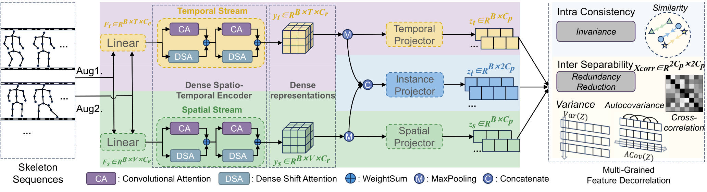
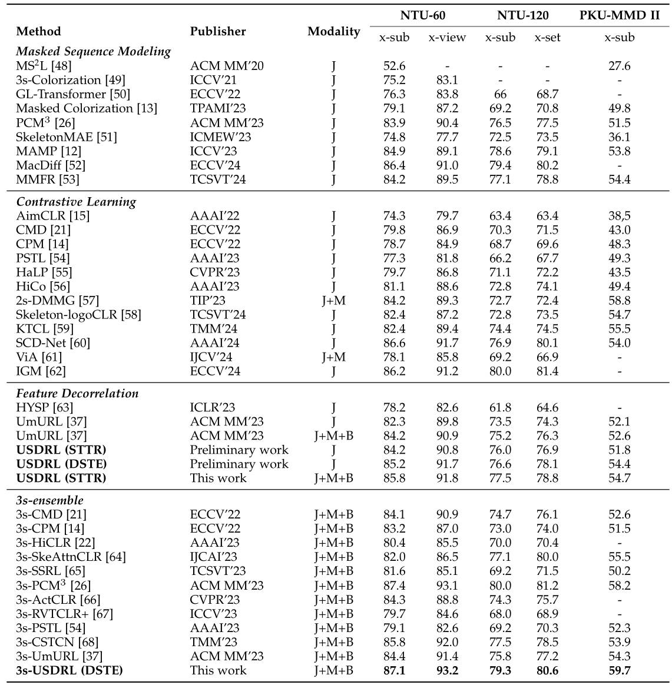

# Foundation Model for Skeleton-Based Human Action Understanding

<a href="https://pytorch.org/get-started/locally/"></a> [](https://arxiv.org/abs/2508.12586) [](https://huggingface.co/wengwanjiang/FoundSkelModel)

This is the official PyTorch implementation of the paper "[Foundation Model for Skeleton-Based Human Action Understanding](https://arxiv.org/abs/2508.12586)".


## Framework



## Abstract

Human action understanding serves as a foundational pillar in the field of intelligent motion perception. As reliable skeleton data has become increasingly accessible and skeletons serve as a modality- and device-agnostic representation for human modeling, skeleton-based human action understanding has gained significant popularity over the past decade. However, existing works often lack the scalability and generalization required to handle diverse action understanding tasks. In addition, dense prediction tasks such as temporal action detection and action prediction have been largely overlooked. This paper presents a Unified Skeleton-based Dense Representation Learning (USDRL) framework, which serves as a foundational model for skeleton-based human action understanding. USDRL consists of a Transformer-based Dense Spatio-Temporal Encoder (DSTE), Multi-Grained Feature Decorrelation (MG-FD), and Multi-Perspective Consistency Training (MPCT). The DSTE module adopts two parallel streams to learn temporal dynamic and spatial structure features. The MG-FD module collaboratively performs feature decorrelation across temporal, spatial, and instance domains to reduce dimensional redundancy and enhance information extraction. The MPCT module employs both multi-view and multi-modal self-supervised consistency training. The former enhances the learning of high-level semantics and mitigates the impact of low-level discrepancies, while the latter effectively facilitates the learning of informative multimodal features. We perform extensive experiments on 23 benchmarks across across 8 skeleton-based action understanding tasks, overing coarse prediction, dense prediction, and transferred prediction. Our approach significantly outperforms the current state-of-the-art methods. We hope that this work would broaden the scope of research in skeleton-based action understanding and encourage more attention to dense prediction tasks.


## Planned Release

The following components will be progressively released to facilitate reproduction and further research:
- [X] Release pretrained model weights.
- [X] Release process scripts for PKU-MMD, NTU2D, and UAV datasets.
- [ ] Release implementation for skeleton-based action segmentation.
- [X] Release implementation for skeleton-based early-action prediction.
- [ ] Release implementation for skeleton-based action detection.
- [ ] Release complete training and testing scripts. 


## Requirements

```bash
python==3.8.13
torch==1.8.0+cu118
```


## Getting Started

| Task                               | Document                             |
| ---------------------------------- | ------------------------------------ |
| Pretrain                   | [docs/pretrain.md](docs/pretrain.md) |
| Skeleton-based action recognition  | [docs/recog.md](docs/recog.md)     |
| Skeleton-based action detection    | [docs/detect.md](docs/detect.md)     |
| Skeleton-based action segmentation | [docs/segment.md](docs/segment.md)         |


## Model Zoo

| Model                                          | Download Link                                                | Performance                  |
| :--------------------------------------------- | ------------------------------------------------------------ | ---------------------------- |
| Pretrained Models (NTU3D, NTU2D, UAV, PKU-MMD) | [OneDrive](https://1drv.ms/), [BaiduDisk (passwd: 1234)](https://pan.baidu.com/s/1MIHkMrc4_uZRAxMkX0oc8Q) | -                            |
| Skeleton-based Action Segmentation (PKU-MMD )  | [OneDrive](https://1drv.ms/), [BaiduDisk (passwd: xxxx)](https://1drv.ms/) | 68.7% (Acc), 67.5% (Edit)    |
| Skeleton-based Action Detection (PKU-MMD)      | [OneDrive](https://1drv.ms/), [BaiduDisk (passwd: xxxx)](https://1drv.ms/) | 75.7% (mAP_a), 74.9% (mAP_v) |


## Main Results



## Citation

If you find our work useful for your project, please consider citing the paper:

```bibtex
@inproceedings{wengUSDRL25,
  title={USDRL: Unified Skeleton-Based Dense Representation Learning with Multi-Grained Feature Decorrelation},
  author={Wanjiang Weng and Hongsong Wang and Junbo Wang and Lei He and Guosen Xie},
  booktitle={Proceedings of the AAAI Conference on Artificial Intelligence},
  year={2025}
}

@article{wengUSDRL25plus,
  title={Foundation Model for Skeleton-Based Human Action Understanding},
  author={Hongsong Wang and Wanjiang Weng and Junbo Wang and Fang Zhao and Guo-sen Xie and Xin Geng and  Liang Wang},
  journal={Transactions on Pattern Analysis and Machine Intelligence},
  year={2025}
}
```


## Acknowledgments

This code is standing on the shoulders of giants. We want to thank the following contributors
that our code is based on:

[VICReg](https://github.com/facebookresearch/VICRegL), [UmURL](https://github.com/HuiGuanLab/UmURL), [LaSA](https://github.com/HaoyuJi/LaSA), [DeST](https://github.com/lyhisme/DeST), [NTURGB-D](https://github.com/shahroudy/NTURGB-D), [PKU-MMD](https://github.com/ECHO960/PKU-MMD), [UAV](https://github.com/SUTDCV/UAV-Human)


## License

This code is distributed under an [MIT LICENSE](LICENSE).

Note that our code depends on other libraries and uses datasets that each have their own respective licenses that must also be followed.


